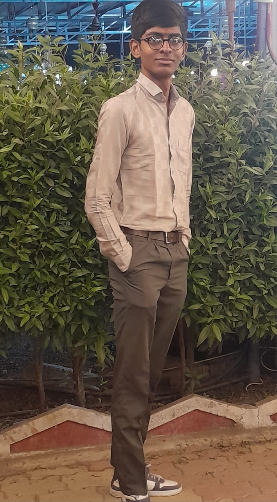

# 🌟 Modern Professional Portfolio | Jay Dobariya

<div align="center">
  
  
  
</div>

<br />

<div align="center">
  <h3>
    <a href="https://incandescent-panda-ffd3b2.netlify.app/">Live Demo</a> | 
    <a href="https://github.com/Jay9959">GitHub</a> | 
    <a href="mailto:dobariyajay9959@gmail.com">Contact Me</a>
  </h3>
</div>

---

## 🚀 About This Project

This is my personal portfolio website, designed to showcase my skills, projects, and educational background as a **Frontend Developer**. Built with a focus on clean UI/UX, responsiveness, and interactive elements, this project represents my journey in web development.

### ✨ Key Features
- **🎨 Dynamic Style Switcher**: Real-time theme color customization (5 different skins).
- **🌓 Dark/Light Mode**: Seamless transition between light and dark themes.
- **📱 Fully Responsive**: Optimized for all devices (Mobile, Tablet, Desktop).
- **⌨️ Interactive Typing Animation**: Engaging intro powered by `Typed.js`.
- **📧 Working Contact Form**: Integrated with `FormSubmit` for direct email communication.
- **🎭 Smooth Transitions**: Elegant section transitions and hover effects.

---

## 🛠️ Tech Stack

<div align="left">
  
  
  
  
  
</div>

- **Structure**: Semantic HTML5
- **Styling**: Vanilla CSS3 (Custom Properties & Flexbox)
- **Interactions**: Vanilla JS & jQuery
- **Animations**: Typed.js & CSS Keyframes
- **Icons**: FontAwesome 5

---

## 📂 Project Showcase

Some of the featured projects included in this portfolio:

| Project | Live Link | Description |
| :--- | :--- | :--- |
| **Saathi AI** | [View Live](https://ai-chatboat-saathi-ai.netlify.app/login.html) | Advanced AI Chatbot Interface |
| **ResumeIQ AI** | [View Live](https://resumeiq-ai-five.vercel.app/) | AI-powered resume analysis tool |
| **Recipe Book** | [View Live](https://recipe-book-git-main-jay9959-9734b01b.vercel.app/) | Dynamic recipe searching application |
| **Calculator** | [View Live](https://calculator-git-main-jay9959-06a40232.vercel.app/) | Clean & functional Neumorphic calculator |

---

## 📸 Preview

<div align="center">
  
  <p><i>(Preview of the Desktop Interface)</i></p>
</div>

---

## ⚙️ Installation & Usage

1. **Clone the repository:**
   ```bash
   git clone https://github.com/Jay9959/protfolio.git
   ```
2. **Navigate to the project folder:**
   ```bash
   cd protfolio
   ```
3. **Open `index.html` in your browser:**
   - Double-click the file or use an extension like **Live Server** in VS Code.

---

## 📬 Get In Touch

I am always looking for new opportunities and collaborations!

- **Email**: [dobariyajay9959@gmail.com](mailto:dobariyajay9959@gmail.com)
- **Phone**: +91 95103 49562
- **LinkedIn**: [Jay Dobariya](https://www.linkedin.com/in/jay-dobariya-8422472b8/) *(Update with your link)*
- **GitHub**: [@Jay9959](https://github.com/Jay9959)

---

<div align="center">
  Made with ❤️ by Jay Dobariya
</div>
