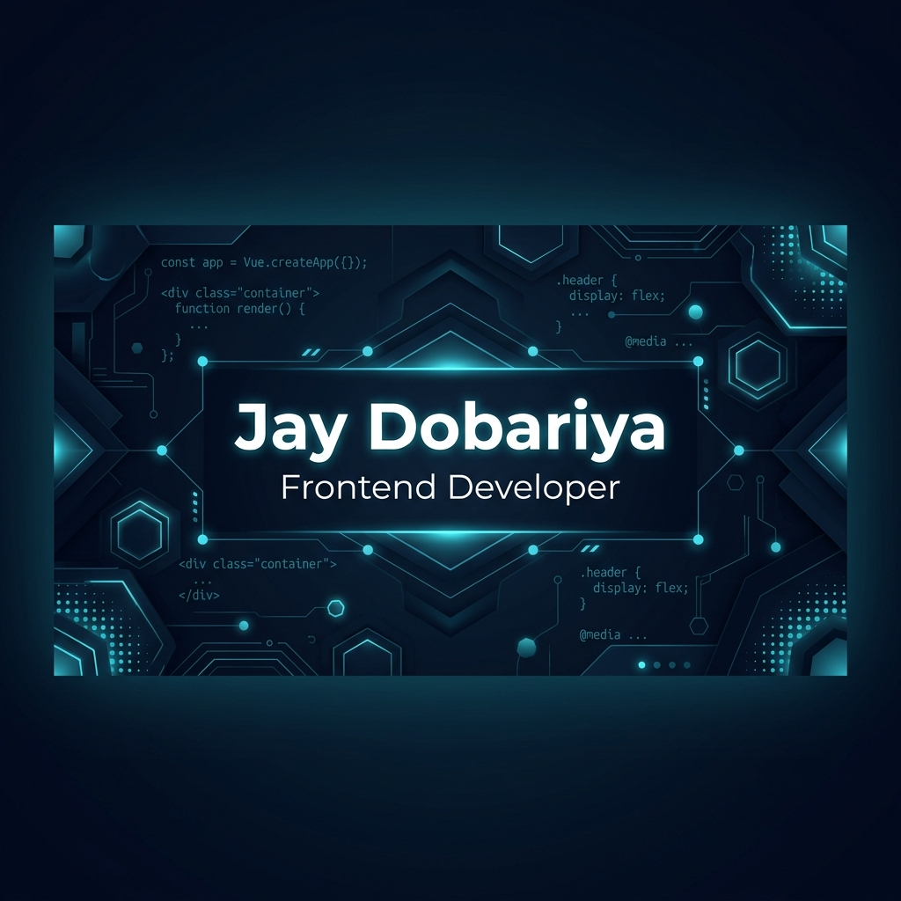
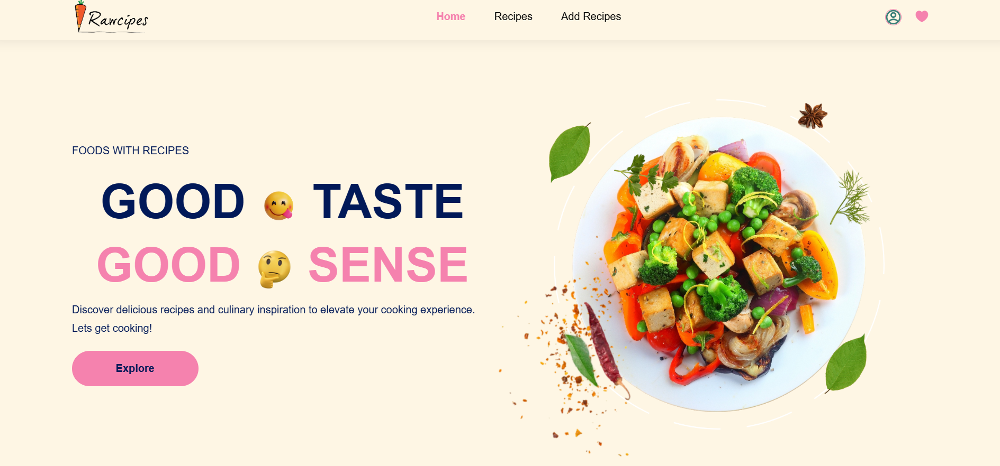

<div align="center">
  
  <br />
  <h1>✨ Jay Dobariya | Frontend Engineer ✨</h1>
  <p>Crafting High-Performance, Visually Stunning, and Interactive Web Experiences</p>
  <br />
  
  <a href="https://incandescent-panda-ffd3b2.netlify.app/">
    
  </a>
  <a href="mailto:dobariyajay9959@gmail.com">
    
  </a>
  <a href="https://github.com/Jay9959">
    
  </a>
</div>

---

## 🚀 Welcome to My Digital Space

This repository contains my personal portfolio—a high-end, **Next-Gen Web Architecture** experience. It features a complete **Glassmorphic Design System**, custom interactive cursor, and premium scroll-reveal animations.

### 💎 Performance & Aesthetic Highlights
- **🎨 Kinetic UI**: Fluid animations with 60FPS performance and custom blob triggers.
- **🌓 Adaptive Theme**: Seamless dark/light mode toggle with 5 custom-engineered color skins.
- **⌨️ Advanced Interactions**: Custom-scripted interactive cursor and scroll-spy navigation.
- **⚡ Ultra Fast**: Optimized for core web vitals and mobile-first responsiveness.
- **🔗 Smart Contact**: Direct integration with automated mail servers and social APIs.

---

## 🛠️ The Tech Stack Arsenal

<div align="center">
  <table>
    <tr>
      <td align="center" width="96">
        
        <br />HTML5
      </td>
      <td align="center" width="96">
        
        <br />CSS3
      </td>
      <td align="center" width="96">
        
        <br />JavaScript
      </td>
      <td align="center" width="96">
        
        <br />jQuery
      </td>
      <td align="center" width="96">
        
        <br />React
      </td>
      <td align="center" width="96">
        
        <br />Bootstrap
      </td>
    </tr>
  </table>
</div>

---

## 📂 Featured Innovations

<div align="center">
  <table width="100%">
    <tr>
      <td width="33%">
        
        <br />
        <b>Saathi AI</b><br />
        Integrated GPT-based assistant 🤖
      </td>
      <td width="33%">
        
        <br />
        <b>ResumeIQ</b><br />
        AI-driven profile analyzer 📝
      </td>
      <td width="33%">
        
        <br />
        <b>Recipe Hunter</b><br />
        Global culinary database 🍳
      </td>
    </tr>
  </table>
</div>

---

## ⚙️ Direct Installation

```bash
# Clone the vision
git clone https://github.com/Jay9959/protfolio.git

# Enter the dimension
cd protfolio

# Launch the experience
# Open index.html in any modern browser
```

---

## 📬 Connect & Collaborate

<div align="center">
  
  
  
  
  <br />
  <p>Available for Full-time roles and Freelance Innovations</p>
</div>

---

<p align="center">
  Designed & Built with ❤️ by <b>Jay Dobariya</b> | © 2024
</p>
